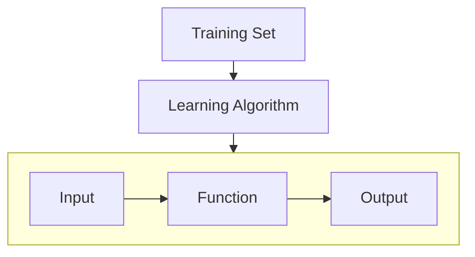

## Regression Models
As a reminder, there are two types of supervised learning models: regression models and classification models. Supervised learning models predict the output when given an input. The training data has "right answers" for a range of input values. 

A regression model is a type of supervised learning model that predicts numbers. A classification model is a type of supervised learning model that predicts categories.

## Terminology
* The training set is the data used to train the model.
* x = "input" variable or feature. ex. `x = 2104`
* y = "output" variable or "target" variable. ex. `y = 400`
* m = the total number of training examples. ex. `m = 47`
* (x, y) = a single training example. ex. `(2104, 400)`
* ($x^{(i)}, y^{(i)}$) = $i^{th}$ training example. (1st, 2nd, 3rd, etc.) ex. $x^{(1)}$ = 2104, $y^{(1)}$ = 400. Note: $x^{(2)} \neq x^2$. **This is not exponentiation!**

| x (size in feet²) | y (price in $1000's) |
| ----- | ------ |
| (1) 2104 | 400 |
| (2) 1416 | 232 |
| (3) 1534 | 315 |
| (4) 852 | 178 |
| ... ... | ... |
| (47) 3210 | 870 |

**Flowchart for a Linear Regression Model**

The representation of the function, $f$ is as follows: $f_{w, b} = wx + b$. Note that this is specific for a linear regression with one variable. This is also known as **univariate** linear regression.

## The Cost Function
As a refresher, for our linear regression model $f_{w, b} = wx + b$, the $w$ and $b$ are known as the "parameters" of our model. These are also known as **coefficients** or **weights**.

The cost function is defined as follows:
> J($w$, $b$) = $\frac{1}{2m}\sum_{i = 1}^m (\hat{y}^{(i)} - y^{(i)})^2$, $m$ = the number of training examples.

> Plugging in $f_{w, b}$, we get that J($w$, $b$) = $\frac{1}{2m}\sum_{i = 1}^m (f_{w, b}(x^{(i)}) - y^{(i)})^2$

This is known as the **squared error cost function**. For a great model, we want to find $w$ and $b$ such that $\hat{y}^{(i)}$ is as close to $y^{(i)}$ as possible for all ($x^{(i)}, y^{(i)}$). We want to find $w$ and $b$ such that J($w$, $b$) is as small as possible. Mathematically, we write this as $\underset{w, b}{\text{minimize}}$ J($w$, $b$).

To better visualize this, let's work with a simplified cost function $f_{w}(x) = wx$, b = 0. Now, our cost function is J($w$) = $\frac{1}{2m}\sum_{i = 1}^m (f_{w}(x^{(i)}) - y^{(i)})^2$. The goal is a bit different now: $\underset{w}{\text{minimize}}$ J($w$).
